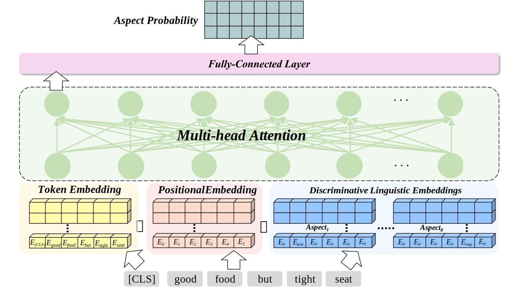

# LiFeBERT

An overview of my model:

[model.py](model.py): model's construction in Pytorch

[playground.ipynb](playground.ipynb): Log-likelihood Ration calculator and model flow. This calculator will be splitted to a seperate file in the future.

Please note that the TripAdvisor Airline Review Dataset is not available yet.
